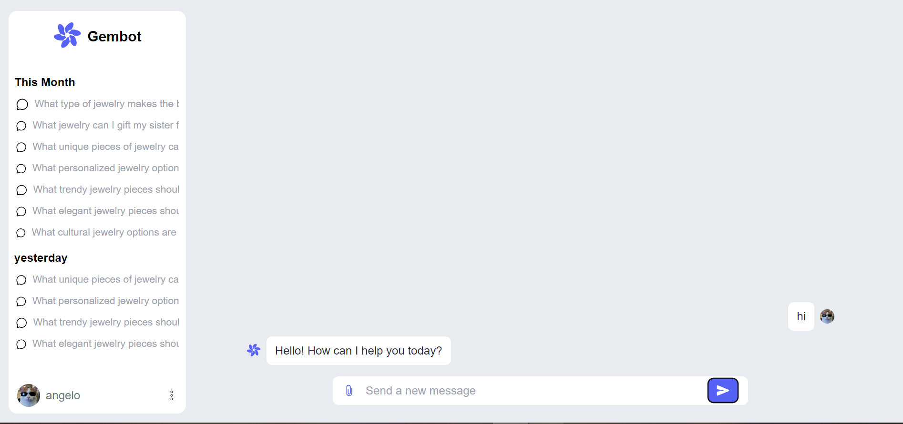

# Gembot



Gembot is a chat application designed to assist users with jewelry-related inquiries. It leverages a backend service for AI-powered responses, making it easy to find the best jewelry recommendations.

## Technologies Used

### Frontend
- **React**: A JavaScript library for building user interfaces.
- **Redux**: State management library for managing the application state.
- **Axios**: Promise-based HTTP client for making requests to the backend.
- **Tailwind CSS**: A utility-first CSS framework for styling.

### Backend
- **Node.js**: JavaScript runtime for building the server.
- **Express**: Web framework for Node.js to handle API requests.
- **Axios**: Used for making HTTP requests to external services (if applicable).
- **CORS**:used for connecting backend to frontend.

## Getting Started

Follow these steps to run the project locally.

### Prerequisites

- [Node.js]
- [npm]


### Clone the Repository

```bash
git clone https://github.com/peyush-nuwal/gembot.git
cd gembot
```

### Setup the Backend

1. Navigate to the backend directory:

    ```bash
    cd backend
    ```

2. Install the backend dependencies:

    ```bash
    npm install
    ```

3. Start the backend server:

    ```bash
    npm  start
    ```

### Setup the Frontend

1. Open a new terminal and navigate back to the root directory of the project:

    ```bash
    cd frontend
    ```

2. Install the frontend dependencies:

    ```bash
    npm install
    ```

3. Start the frontend application:

    ```bash
    npm run dev
    ```

## Usage

Once both the backend and frontend servers are running, you can access the chat application at 
backend:[http://localhost:4001/api/chat]((http://localhost:4001/api/chat))  
fronend:[http://localhost:5173](http://localhost:5173). 

You can ask Gembot any questions related to jewelry, and it will provide recommendations and information.

